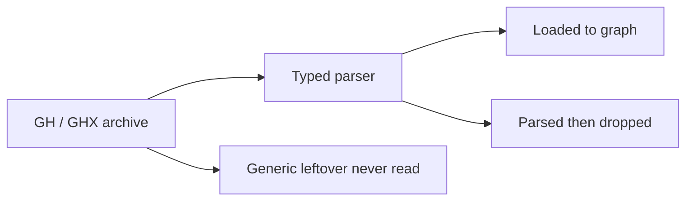

# Grasshopper data ignored by the importer

This is an inventory, not a proposal to import everything. [graph-model.md](graph-model.md) already treats values, dirty bits, and runtime artifacts as later work. The list below is what the fixtures actually contain that never reaches Neo4j.

## Method and coverage

- **Importer** = GHX/GH parser ([GrasshopperLib/Parser/GhxArchive.cs](../GrasshopperLib/Parser/GhxArchive.cs)) + snapshot builder ([GrasshopperLib/Loader/GhxSnapshotBuilder.cs](../GrasshopperLib/Loader/GhxSnapshotBuilder.cs)). The CLI POSTs the snapshot as GraphQL `importSnapshot`.
- **testdata/**: 19 committed `.ghx` parser fixtures (walked as XML).
- **testdataExt/**: gitignored; 383 `.ghx` + 1 cluster `.xml` walked as XML (935 distinct component type names). 663 binary `.gh` files were not XML-walked; they use the same GH_IO schema after conversion.
- Nested `ClusterDocument` blobs are decoded for **topology** only. Their inner extras match the same categories.

Two ignore layers:

1. **Parsed but not loaded** — typed fields exist on `IGhxChunk`* but [GhxSnapshotBuilder](../GrasshopperLib/Loader/GhxSnapshotBuilder.cs) never maps them.
2. **Never consumed** — present as generic `item`/`chunk` data; the typed parser does not even surface them.

## What *is* imported (for contrast)

- **Document:** `DocumentID`, content-hash `VersionId`, file name/path/timestamps, `IsNested`. Nested cluster `FileName` comes from `DefinitionProperties.Name`.
- **Node:** instance GUID, type GUID/name, `Name`/`NickName`, `Kind`, `Locked`, pivot `X`/`Y`, scribble `Text`, script `Source`/`Language`, `gh.`* script and cluster extensions.
- **Port:** instance GUID, `Name`, `Direction`, `Access` (`item`/`list`/`tree`).
- **Edge:** `Source` GUID lists as `EDGE`; cluster `ParamMap` as edge/node extensions.
- **Group membership:** container `ID` GUIDs as `MEMBER_OF` (colour/border not stored).
- **Libraries:** `Id`, `Name`, `Author`, `Version`, `AssemblyVersion`, `gh.assemblyName`.

---

## 1. Parsed by the typed API, then dropped by the loader

These are the highest-value gaps relative to the current parser.

**Archive / document**

- `ArchiveVersion` (GH_IO format version)
- `plugin_version` (Grasshopper plugin version)
- `DefinitionProperties.Name` / `Description` / `Date` on the root document (name *is* used for nested clusters as `FileName`)
- Cluster I/O `CustomName`, `CustomNickName`, `CustomDescription`

**Node (container)**

- `Description`
- `Hidden` (preview off; testdata `ParserExample5_Modifiers.ghx`)
- `Optional`
- `ReverseData`, `Mapping` (flatten/graft), `SimplifyData` — the whole point of Example 5; only `Locked` is persisted
- `Attributes.Bounds` (size); only `Pivot` becomes `X`/`Y`. Sketch has **no Pivot**, so Example 8 nodes get null coordinates
- `PreviewDocument` on clusters

**Port (`param_input` / `param_output` / `InputParam` / `OutputParam`)**

- `Description`, `NickName`, `Optional`, `Mutable`
- Input `Mapping` (parsed; output mapping is not even typed)
- Port `Attributes.Bounds` / `Pivot`

---

## 2. Document chrome (never consumed)

Present in essentially every testdata and testdataExt GHX.

| Area | Data |
| --- | --- |
| Thumbnail | Root `Thumbnail` bitmap |
| Preview | `Preview`, `PreviewMeshType`, `PreviewNormal`, `PreviewSelected`; testdataExt also `PreviewFilter`; rare `MeshParams` |
| Canvas camera | `Projection.Target`, `Projection.Zoom` |
| Named views | `Views` / `View` (`Name`, `Anchor`, `AnchorIsTarget`, `Zoom`) — testdataExt only |
| Revisions | `RevisionCount`; one file has a `Revision` with `Content`/`Date` |
| Keep-open flag | `DefinitionProperties.KeepOpen` |
| RCP | `RcpLayout.GroupCount`; testdataExt has RCP `Group` (`Name`, `Bounds`, `Colour`, `Collapsed`) |
| Author block | Definition-level `Author` chunk: `Name`, `Company`, `Website`, `EMail`, `Copyright` (testdataExt) |
| Saved states | `StateServer` / `State` (`ID`, `Name`, `Date`, `Data`) (testdataExt) |
| Document ValueTable | `K3DSettings.*`, `ShapeDiver.*` tolerances/ids/versions, `UnionBox`, plus hundreds of plugin keys such as `IsSimplify{guid}` |

---

## 3. Parameter values (`PersistentData`) — largest semantic gap

Trees of `PersistentData` → `Branch` (`Path`, `Count`) → `Item` hold **internalized values**. The importer records that the param exists and how it is wired, not the value. In testdata this is already true for Sphere radius, planes, and ShapeDiver Document Payload. testdataExt scale: ~16k `PersistentData` chunks.

Stored types seen: `gh_double`, `gh_int32`, `gh_bool`, `gh_string`, `gh_guid`, `gh_point3d`, `gh_plane`, `gh_interval1d`/`2d`, `gh_drawing_color`, `gh_drawing_bitmap`, `gh_line`, `gh_bytearray`.

Typical item names: `number`, `boolean`, `string`, `Coordinate`, `plane`, `vector`, `Interval`, `color`, plus **referenced Rhino geometry** (`RefID`, `ON_Data`, `ON_Version`, `EdgeIndex`, `ReferenceData.RefParam`/`RefType`/`RefIndex`) and component-specific blobs (loft options, mesh-brep settings, custom-preview materials `diffuse`/`specular`/…, ShapeDiver payload fields).

---

## 4. Port extras beyond the typed subset

On inputs/outputs, testdataExt also has (never parsed into `IGhxChunkParam*` except where noted):

- `Hidden`, `Locked`, `SimplifyData`, `ReverseData`, `WireDisplay`, `Reparameterize`, `UseDegrees`, `InternalExpression`, `ComponentVersion`, `InvertBooleans`
- Script param metadata: `AllowTreeAccess`, `ScriptParamAccess`, `ShowTypeHints`, `TypeHintID`, `ToolTip`, `ScriptParameterVersion`
- Nested `ConverterData` (`AssemblyName`, `TypeName`)
- Rare: `ExpireOnFileEvent`/`FileFilter` on Read File ports, `Grouping` on Revit-style ports

`Attributes.Selected` appears on some objects (Rhino 6/7 fixtures).

---

## 5. Component-specific state (by family)

Generic leftover on `Container` (and nested chunks). testdata already covers the first four families; testdataExt adds the rest.

**Number Slider** (`Slider` chunk) — testdata Examples 3–4: `Value`, `Min`, `Max`, `Digits`, `Interval`, `SnapCount`, `GripDisplay`

**Scribble** — testdata Example 6: `Text` is loaded; ignored: `Font`, `Size`, `Bold`, `Italic`, corner points `Ca`–`Cd`

**Sketch** — testdata Example 8: `Mark` polylines (`V` points, `VertexCount`), `SketchProperties` (`Color`, `Pattern`, `Width`), `MarkCount`

**Group** — testdata Example 3: member `ID` is loaded; ignored: `Colour`, `Border`, `ID_Count`

**Legacy / RhinoCode scripts** — testdata Example 7: `ScriptSource` / `UsingSource` / `AdditionalSource` / `Script.Text` are loaded. Ignored: `CustomUsing`, `OutParameter`, `ReferenceCount`, `Reference`, `EditorPosition`/`Location`/`Size`, marshal flags, `ScriptEditor.StartBounds`, `LanguageSpec` (`Taxon`, `Version`) except as implied by component GUID, GhPython `CodeInput`, `HideInput`/`HideOutput`, `IsAdvancedMode`, tooltip overrides, `VariableInput`/`VariableOutput`

**Panel** (testdataExt, ~3000): `UserText` (the panel string), `ScrollRatio`, `PanelProperties` (`Colour`, `Wrap`, `Multiline`, `Stream`, `DrawIndices`, `DrawPaths`, `Alignment`, `SpecialCodes`), nested `Font`

**Value List / pickers:** `ListMode`, `ListCount`, `ListItem` (`Name`, `Expression`, `Selected`)

**Colour Swatch / Picker:** `SwatchColor`, `PickedColour`

**Boolean Toggle / Button:** `ToggleValue`, `ExpressionNormal`/`ExpressionPressed`

**Graph Mapper:** `LocalGraph` / `Domain` / `Graph` (`x0`…`y1`, `cpx`/`cpy`, optional `Equation`)

**Gradient:** `Gradient` / `Grip` (`Colour`, `Factor`, `Id`, `GripCount`, `Linear`)

**Path Mapper:** `lexers` (`source`/`target`)

**MD Slider / Gene Pool / Control Knob:** `slider_value`, domains, `GeneData`, `DialData`

**Geometry Pipeline:** layer/name/type filters, `IncludeHidden`/`Locked`, `GroupByLayer`/`Type`

**Image Sampler / Gallery:** path, UV domain, interpolate, local/remote image lists

**Timer / Data Dam / Data Recorder / Jump:** interval, targets, buffer delay, jump group

**Graft/Entwine/Weave/Concatenate/List Item:** `IncludeEmptyLists`/`NullItems`, `FlattenInputs`, `NullGaps`, `JoinSeparator`, `BaseOutputIndex`

**Custom Preview:** `ViewportFilter`, `IncludeInRender`, internalized materials (in PersistentData)

**ShapeDiver inputs:** `text`/`maxlength`, `maximum_file_size`/`selected_file_formats`, `ParameterSchemas`, gumball/selection/points-input chunks (`Enable*Axes`, `PlaneConstraint`, `NameFilters`, `DefaultValue`, `LocalTestData`)

**Revit / Speckle / IFC / other plugins:** family-picker lists, `KitName`, stream wrappers, `EncryptedDocument` (cluster payload not decoded), `IsSimplify`* ValueTable keys, etc. (~200 extra container item names; most appear on one plugin type)

**Display/layout on params:** `WireDisplay`, `IconDisplay`, `IconOverride`, panel `Attributes.Margin`*

---

## 6. testdata file → ignored data (fixture map)

- **ParserExample1:** thumbnail, preview, camera, ValueTable (`K3DSettings`, ShapeDiver keys), descriptions, bounds, PersistentData (incl. ShapeDiver Document Payload)
- **ParserExample2:** `ParameterData` counts/`InputId`/`OutputId`, `ConverterData`, more PersistentData
- **ParserExample3:** group colour/border, slider `Slider` chunk, PersistentData
- **ParserExample4:** cluster `PreviewDocument`, slider values, nested cluster internals except topology/`ParamMap`
- **ParserExample5:** `Hidden`, `ReverseData`, `Mapping`, `SimplifyData` (parsed, not loaded); `Locked` is loaded
- **ParserExample6:** scribble styling around imported `Text`
- **ParserExample7:** script editor/marshal/using flags around imported source
- **ParserExample8:** sketch geometry and style; no pivot so no `X`/`Y`

---

## 7. Intentionally adjacent (not “forgotten topology”)

Wires are not stored as objects in GH; `Source` GUID lists **are** imported as `EDGE`. What is missing is wire *style* (`WireDisplay`) and all **values**. Floating params without connections still get nodes; internalized data on those params is the PersistentData gap above.
